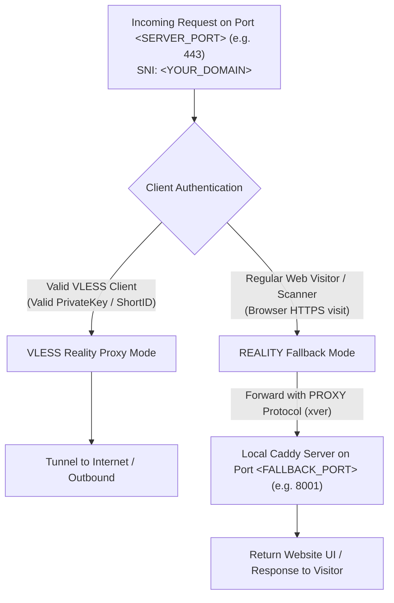

# Rcon Traffic Routing & Proxy Protocol Logic

## Overview & Architecture

This document describes the routing flow, proxy protocol behavior, and fallback mechanisms for VLESS REALITY nodes in Rcon with local web server integration (Steal-Oneself mode).

---

## 1. Port Allocation & Traffic Multiplexing

- **Front-end Listener (`<SERVER_PORT>`, e.g., `443`):**
  - Rcon binds and listens on the configured server port (`0.0.0.0:<SERVER_PORT>`).
  - The node is assigned with a domain / SNI configured in the dashboard (e.g., `<YOUR_DOMAIN>`).
- **Local Fallback Web Server (Caddy/Nginx on `<FALLBACK_PORT>`, e.g., `8001`):**
  - A local web server (e.g. Caddy) listens on a local port (`127.0.0.1:<FALLBACK_PORT>` / `<YOUR_DOMAIN>:<FALLBACK_PORT>`).
  - It serves the website interface and camouflage content.

---

## 2. Traffic Flow & Routing Decisions



### Path A: Regular Website Visitor (Browser / HTTPS Visit)
1. A standard browser visits `https://<YOUR_DOMAIN>:<SERVER_PORT>`.
2. The TLS handshake reaches Rcon on `<SERVER_PORT>`.
3. REALITY evaluates the handshake: because it is a regular HTTPS request (not a valid VLESS client), it triggers **REALITY Fallback**.
4. Traffic is transparently forwarded to the fallback destination (`127.0.0.1:<FALLBACK_PORT>` / Caddy).
5. Caddy responds with the web interface to the browser through the front-end port tunnel.

### Path B: VLESS Proxy Client
1. A client app (v2rayN, Clash, Sing-box, etc.) connects with valid VLESS credentials and REALITY keys.
2. Handshake succeeds as a valid proxy session.
3. Traffic is handled by the proxy core and routed to the target outbound destination.

---

## 3. Proxy Protocol & `xver` Configuration

### Inbound vs Outbound Proxy Protocol

| Parameter | Direction | Scope | Purpose |
| :--- | :--- | :--- | :--- |
| **`AcceptProxyProtocol`** / `EnableProxyProtocol` | Inbound | `<SERVER_PORT>` (e.g. `443`) | Enables Rcon to accept incoming PROXY protocol headers from an upstream front-end proxy (e.g., HAProxy / Cloudflare Spectrum). |
| **`xver`** (Proxy Protocol Version) | Outbound Fallback | `<SERVER_PORT>` &rarr; `<FALLBACK_PORT>` (e.g. `443` &rarr; `8001`) | Instructs REALITY to prepend a PROXY protocol header (v1 or v2) when forwarding fallback traffic to the local web server, allowing it to log the real visitor's IP. |

### Configuration

To enable local fallback with real visitor client IP forwarding to Caddy:

1. **Rcon `config.json` Node Settings:**
   ```json
   {
       "Core": "xray",
       "ApiHost": "https://<YOUR_API_HOST>",
       "ApiKey": "<YOUR_API_KEY>",
       "NodeID": <NODE_ID>,
       "NodeType": "vless",
       "ListenIP": "0.0.0.0",
       "XrayOptions": {
           "EnableProxyProtocol": true,
           "EnableFallback": false
       }
   }
   ```

2. **Dashboard / TLS Settings for the Node:**
   ```json
   {
       "server_name": "<YOUR_DOMAIN>",
       "dest": "127.0.0.1",
       "server_port": "<FALLBACK_PORT>",
       "xver": "1"
   }
   ```
   - `xver: "1"` sends PROXY protocol v1 (text format).
   - `xver: "2"` sends PROXY protocol v2 (binary format).
   - The local web server (e.g. Caddy) listening on `<FALLBACK_PORT>` must have `proxy_protocol` enabled to parse this header and capture the true visitor IP.
